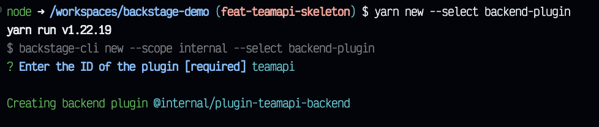

# TeamAPI

## How I develop this plugin

First, I create the frontend plugin through:

```sh
yarn new --select plugin
```


Then, I create the backend plugin through:

```sh
yarn new --select backend-plugin
```



Then, I register the backend plugin to the backend portal.

```sh
yarn add --cwd packages/backend @internal/plugin-teamapi-backend@^0.1.0
```

Then, I add the plugin router information in backend with the creation of `packages/backend/src/plugins/teamapi.ts` file and refer it in `packages/backend/src/index.ts`.

Then, I developed the backend plugin, to configure the router.

Then, I developed the frontend plugin.

The backend will fetch the `TEAMAPI.md` file of the project's repository.

Et voilà 😉
